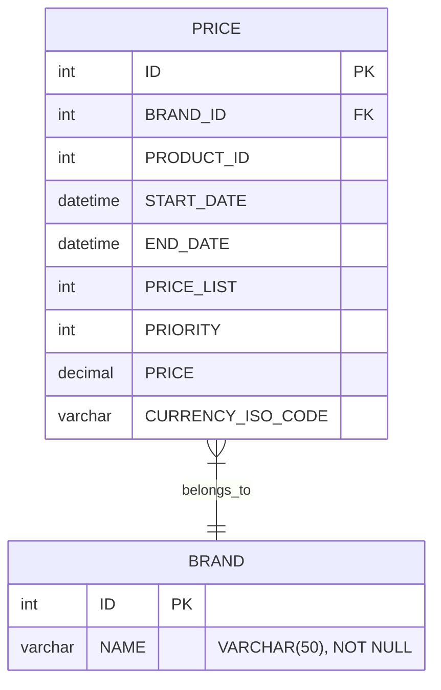

# Pricing Service

REST API para consultar el precio aplicable a un producto y una marca en una
fecha determinada. El proyecto utiliza Java 21 y Spring Boot, sigue una
arquitectura hexagonal y adopta un enfoque API First: el contrato OpenAPI es la
fuente para generar la interfaz HTTP y sus DTOs. Para la ejecución se utiliza H2
como base de datos en memoria.

## Tecnologías

- Java 21 y Spring Boot 4.1.1
- Spring Web MVC
- Spring Data JPA y Hibernate
- H2
- OpenAPI 3.0.3 y OpenAPI Generator 7.21.0
- MapStruct 1.6.3 y Lombok
- Maven Wrapper
- JUnit 5, Mockito, Spring Boot Test y AssertJ

## Arquitectura

El código se organiza alrededor de los límites de la arquitectura hexagonal:

- **`domain`** contiene el modelo `Price`, independiente de Spring y JPA.
- **`application`** define el caso de uso de consulta, sus puertos de entrada y
  salida, y los errores funcionales.
- **`infrastructure`** conecta la aplicación con tecnologías concretas:
  configuración Spring, API web, logging y persistencia JPA.
- **API/web** implementa el puerto de entrada mediante `PricingController`.
  `PricingApi` y los DTOs se generan a partir del contrato OpenAPI. MapStruct
  transforma el modelo de dominio al DTO de respuesta.
- **Persistencia** implementa el puerto de salida con
  `PricePersistenceAdapter`, `PriceJpaRepository` y `PriceEntity`. El mapper
  MapStruct convierte la entidad JPA al modelo de dominio.

La capa de aplicación define los puertos y los adapters de infraestructura los 
implementan. De este modo, la aplicación no depende de tecnologías concretas 
como HTTP o JPA. `ApplicationConfig` registra el caso de uso como bean.

## Modelo de datos



## Consulta de precios

```http
GET /api/v1/prices
```

Parámetros query obligatorios:

| Parámetro | Tipo | Formato / descripción |
|---|---|---|
| `applicationDate` | `LocalDateTime` | Fecha y hora local, por ejemplo `2020-06-14T16:00:00`, sin zona horaria |
| `productId` | `Integer` | Identificador del producto |
| `brandId` | `Integer` | Identificador de la marca o cadena |

La consulta selecciona los registros que coinciden con el producto y la marca,
cuyo intervalo incluye la fecha (`START_DATE <= applicationDate <= END_DATE`)
y tienen la máxima prioridad entre los registros aplicables. Si no hay
coincidencias, la API responde `404`. Si varias filas empatan en la prioridad
más alta, la aplicación devuelve el error `DUPLICATED_PRICE`.

### Ejemplo

Petición:

```text
GET http://localhost:8080/api/v1/prices?applicationDate=2020-06-14T16:00:00&productId=35455&brandId=1
```

Respuesta `200 OK`:

```json
{
  "productId": 35455,
  "brandId": 1,
  "priceList": 2,
  "startDate": "2020-06-14T15:00:00",
  "endDate": "2020-06-14T18:30:00",
  "price": 25.45
}
```

Los nombres y tipos de los campos corresponden al esquema `PriceResponse` del
contrato OpenAPI y a `PriceResponseDTO`. Las fechas son cadenas de fecha-hora
local sin zona horaria.

## Errores e internacionalización

Los errores usan `ErrorResponseDTO` con los campos `status`, `errorType`,
`code` y `message`.

| Situación | HTTP | `code` |
|---|---:|---|
| No existe un precio aplicable (`PRICE_NOT_FOUND`) | 404 Not Found | `PRICE-001` |
| Varios precios empatan en la prioridad máxima (`DUPLICATED_PRICE`) | 500 Internal Server Error | `PRICE-002` |
| Falta un parámetro requerido | 400 Bad Request | `MISSING_PARAMETER` |
| Un parámetro tiene formato inválido | 400 Bad Request | `INVALID_PARAMETER` |
| Error no contemplado | 500 Internal Server Error | `INTERNAL_ERROR` |

Los mensajes se resuelven mediante Spring `MessageSource`. Los bundles
disponibles son `messages.properties` (base), `messages_en.properties` y
`messages_es.properties`; Spring selecciona el idioma según el locale de la
petición, incluido en la cabecera `Accept-Language`.

## Logging

`HttpLoggingFilter` registra método, URI, query, headers permitidos, estado,
cuerpo de respuesta y duración. Genera un `requestId`, lo mantiene en MDC
durante el procesamiento y lo elimina al finalizar la petición. El patrón de
consola de `application.yml` incluye ese identificador.

`LoggingAspect` intercepta métodos de clases de casos de uso cuyo nombre termina
en `UseCaseImpl` dentro de `application.usecase`, y métodos de clases cuyo
nombre termina en `Adapter` dentro de
`infrastructure.out.persistence.jpa.adapter`. Registra los argumentos, el
resultado o el estado de error y el tiempo de ejecución.

## Configuración y ejecución local

La configuración común está en `src/main/resources/application.yml`. Define el
context path `/api`, el formato de logs, `ddl-auto: none`, añade H2 en memoria,
carga `sql/schema.sql` y `sql/data.sql` y habilita H2 Console.

Desde la raíz del proyecto, inicia la aplicación:

```bash
./mvnw spring-boot:run
```

En Windows:

```powershell
.\mvnw.cmd spring-boot:run
```

La API queda disponible en `http://localhost:8080/api/v1/prices`. La consola
H2 está en `http://localhost:8080/api/h2-console`. La conexión configurada es:

| Campo | Valor |
|---|---|
| JDBC URL | `jdbc:h2:mem:pricingdb` |
| Usuario | `sa` |
| Contraseña | Vacía |

## Tests y build

El perfil `test` utiliza una base H2 independiente y carga
`sql/schema.sql` y `sql/test-data.sql`.

Ejecutar la suite:

```bash
./mvnw test
```

En Windows:

```powershell
.\mvnw.cmd test
```

Generar el artefacto Maven:

```bash
./mvnw package
```

En Windows:

```powershell
.\mvnw.cmd package
```

## Estructura del proyecto

```text
src/
├── main/
│   ├── java/com/lsp/pricingservice/
│   │   ├── application/
│   │   │   ├── exception/
│   │   │   ├── port/in/
│   │   │   ├── port/out/
│   │   │   └── usecase/
│   │   ├── domain/model/
│   │   └── infrastructure/
│   │       ├── config/
│   │       ├── in/web/
│   │       │   ├── exception/
│   │       │   ├── filter/
│   │       │   └── mapper/
│   │       ├── logging/
│   │       └── out/persistence/jpa/
│   │           ├── adapter/
│   │           ├── entity/
│   │           ├── mapper/
│   │           └── repository/
│   └── resources/
│       ├── openapi/openapi-rest.yaml
│       ├── sql/
│       ├── application.yml
│       └── messages*.properties
└── test/
    ├── java/com/lsp/pricingservice/
    └── resources/
        ├── application-test.yml
        └── sql/test-data.sql
```
